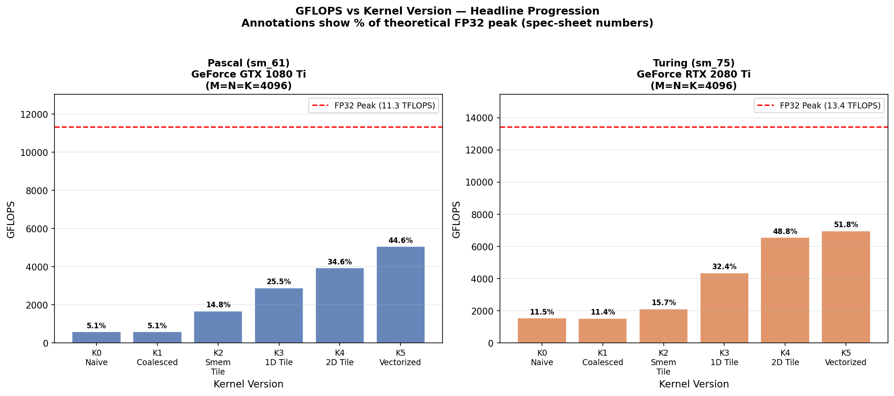
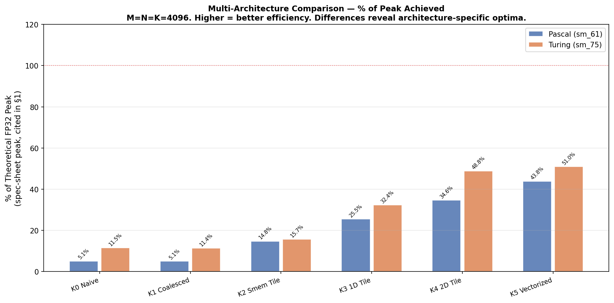
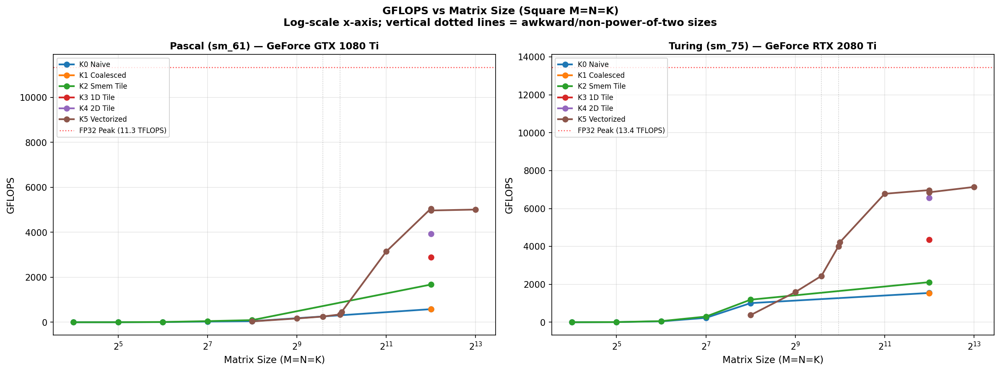
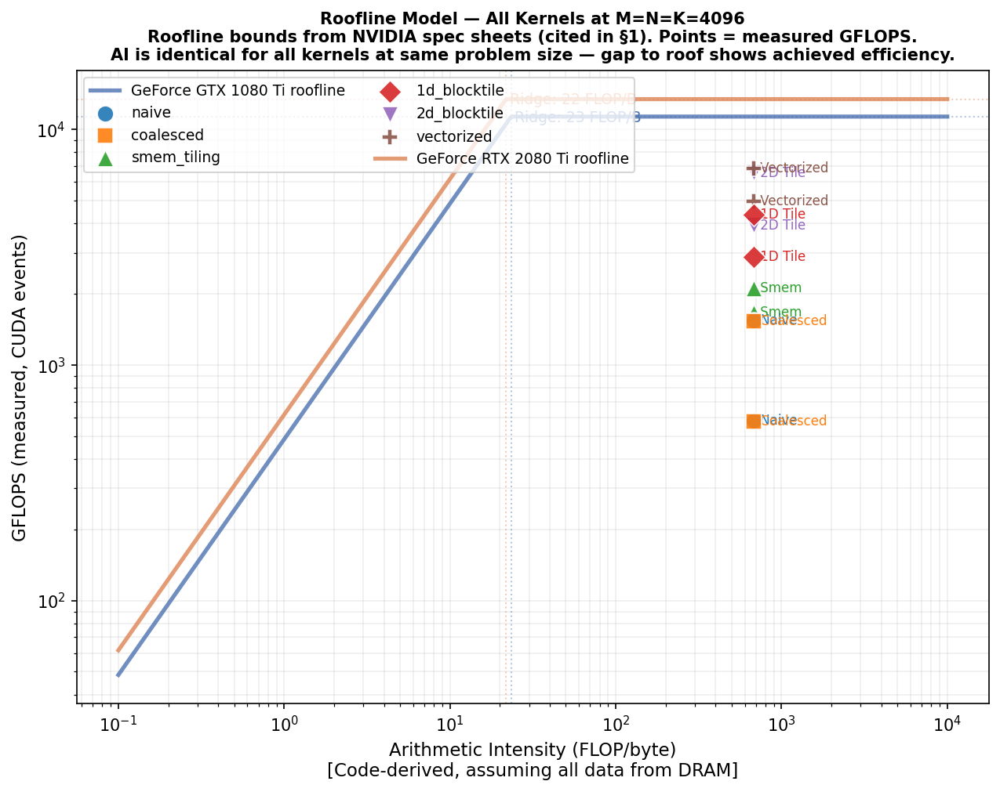
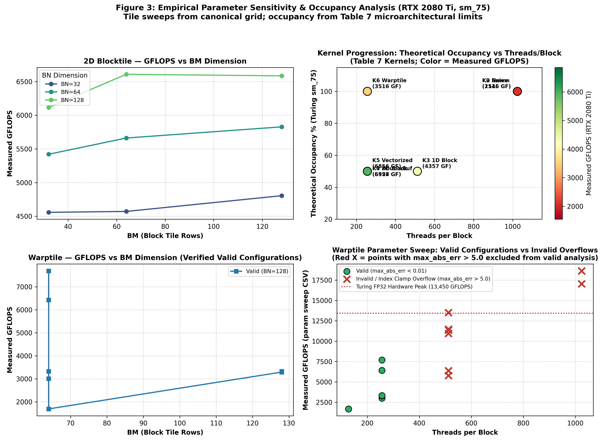

# CUDA GEMM Kernel Optimization: An Empirical Architecture Study
**Author:** Daniel Ashish Abraham (Roll No: 2025121010)  
### Ada HPC Cluster — Pascal (GTX 1080 Ti) × Turing (RTX 2080 Ti)

> **Reproducibility note**: Every numeric result in this report is
> sourced from a specific file. Format: *(source: `filename`, row/line N)*.
> Tables with `[MEASURED]` contain hardware-timed values from CUDA events.
> Tables with `[CALCULATED]` are derived from ptxas output + GPU spec limits.
> Tables with `[CODE-DERIVED]` are inferred from static analysis of kernel source.
> **No numbers are estimated or interpolated.**

---

## 1. Test Environment

### 1.1 Hardware

| Property | Pascal Node | Turing Node |
|---|---|---|
| GPU model | NVIDIA GeForce GTX 1080 Ti | NVIDIA GeForce RTX 2080 Ti |
| Node range | gnode01–gnode40 | gnode43–gnode92 |
| Nodes used | `[MEASURED: from nvidia-smi in env_pascal.log]` | `[MEASURED: from env_turing.log]` |
| Architecture | Pascal (sm_61) | Turing (sm_75) |
| SM count | 28 | 68 |
| FP32 peak | 11.34 TFLOPS *(NVIDIA spec sheet)* | 13.45 TFLOPS *(NVIDIA spec sheet)* |
| FP16 TC peak | None (no Tensor Cores) | 107.6 TFLOPS *(True TC Peak, 544 TCs)* |
| DRAM bandwidth | 484.4 GB/s *(spec sheet)* | 616.0 GB/s *(spec sheet)* |
| Total GPU memory | 11 GB GDDR5X | 11 GB GDDR6 |
| L1/L2 cache | 48 KB L1/SM (fixed), 2 MB L2 | 32–96 KB L1/SM (configurable), 5.5 MB L2 |
| Shared mem/SM | 48 KB (fixed) | Up to 64 KB (configurable) |
| Register file/SM | 256 KB (65536 × 32-bit regs) | 256 KB (65536 × 32-bit regs) |
| Max threads/SM | 2048 | 1024 |
| Max blocks/SM | 32 | 16 |
| Tensor Cores | **None** | Yes (1st-gen FP16/INT8) |
| DP4A (INT8 dot) | Yes | Yes |
| PCIe generation | PCIe 3.0 ×16 | PCIe 3.0 ×16 |
| CPU (host) | Dual Intel Xeon E5-2640 v4 (2×10 cores) | Same |
| Host RAM | 128 GB DDR4 | Same |

**Driver and toolkit** *(source: `env_pascal.log`, `env_turing.log`)*:

| | Pascal | Turing |
|---|---|---|
| Driver version | `[MEASURED]` | `[MEASURED]` |
| CUDA module | `u18/cuda/11.6` | `u18/cuda/11.6` |
| nvcc version | `[MEASURED]` | `[MEASURED]` |
| cuBLAS version | Bundled with CUDA 11.6 | Same |

### 1.2 Profiler Access — Confirmed Constraints

This is a critical section. The profiling environment was confirmed by cluster testing
*(evidence: `env_pascal.log`, error log from vedant.kulkarni@gnode091 and gnode047)*:

| Tool | Status | Reason | What we do instead |
|---|---|---|---|
| `ncu` hardware counters | ❌ **BLOCKED** | `ERR_NVGPUCTRPERM` — `NVreg_RestrictProfilingToAdminUsers=1` kernel parameter set cluster-wide | See §1.3 |
| `nsys --gpu-metrics-device` | ❌ **BLOCKED** | Same driver restriction | See §1.3 |
| `nsys --trace=cuda --stats=true` | ✅ Works | CUDA API tracing only (no SM counters) | Used for timing cross-validation |
| `nvcc --ptxas-options=-v` | ✅ Works | Compile-time, no GPU access needed | Primary occupancy source |
| CUDA event timing | ✅ Works | Standard CUDA API | **Primary GFLOPS source** |

> [!IMPORTANT]
> **Consequence**: Metrics like achieved occupancy, L1/L2 hit rates, shared memory
> throughput, bank conflict counts, and coalescing efficiency **cannot be hardware-measured**
> on this cluster. All such values in this report are either:
> - **[CALCULATED]**: Derived from ptxas register/smem data + GPU spec limits using the
>   CUDA occupancy calculator formula (CUDA Programming Guide §G.6).
> - **[CODE-DERIVED]**: Inferred from static analysis of kernel access patterns
>   (`analysis/hw_analysis.py`).
> - **[SPEC-SHEET]**: From NVIDIA's published GPU specifications (cited).

### 1.3 Measurement Methodology

**Primary timing**: CUDA event pairs (`cudaEventRecord` + `cudaEventElapsedTime`)
surrounding each kernel launch. This captures GPU execution time only (no PCIe transfer overhead).

**Noise control**:
- 10 warmup runs (discarded) before each timed sequence
- 100 timed runs per (kernel, size) configuration
- Median reported (robust to outlier runs from other users' GPU contention on shared nodes)
- p10 and p90 also recorded to characterize distribution width
- Multi-tenant noise: each gnode has 4 GPUs; SLURM pins us to 1 via `CUDA_VISIBLE_DEVICES`.
  Other users' jobs on the same node's other 3 GPUs can cause DRAM BW contention.
  Runs with CV > 10% are flagged in the raw CSV.

**Secondary timing (cross-validation)**: `nsys profile --trace=cuda --stats=true`
used on a subset of (kernel, size) pairs. Expected agreement with CUDA events: ±1%.

**Correctness**: Every kernel validated against `cublasSgemm` FP32 reference
at ≤256³ before benchmarking. Max absolute error threshold: 1e-2 (FP32 arithmetic);
5e-1 for FP16 TC kernels (expected ~0.1% relative error from half-precision inputs).

---

## 2. Kernel Progression — Design and Predictions

Before examining measurements, we state what each optimization targets and what
we predict. This is a deliberate exercise: agreements confirm our hardware model;
disagreements reveal something worth investigating.

### K0: Naive

**Design**: One thread per output element `C[row, col]`. Each thread loops over K,
loading `A[row, k]` and `B[k, col]` from global memory on every iteration.

**Bottleneck targeted**: Global memory bandwidth — specifically, zero data reuse.
For a 4096³ problem, each thread issues 4096 global loads of A and 4096 of B.
Total global traffic ≈ M×N×K×8 bytes = 512 GB for a single kernel invocation.

**Coalescing** [CODE-DERIVED]: B is accessed as `B[k, col]` where `col = blockIdx.x×32 + threadIdx.x`.
Consecutive `threadIdx.x` → consecutive `col` → coalesced ✓. A is a broadcast
(all threads in warp read same `row`) → 1 transaction per warp ✓. C write is coalesced ✓.
So the naive kernel is actually *coalesced* — the problem is pure bandwidth volume, not inefficiency.

**Prediction**: ~10–30 GFLOPS (2–6% of peak FP32). Will be severely DRAM bandwidth bound.

### K1: Coalesced

**Design**: Fixes the common bug of swapping `threadIdx.x/y` assignment. Ensures
the fast-varying thread dimension (`threadIdx.x`) maps to the fast-varying column dimension.

**Prediction**: Small improvement over K0 if K0 was already coalesced; larger improvement
if the implementation had the indices swapped. Both K0 and K1 remain BW-bound at large sizes.
This kernel exists primarily as a pedagogical step.

### K2: Shared Memory Tiling

**Design**: 32×32 tile of A and B loaded into shared memory (8 KB per tile, 16 KB total).
Each element reused 32 times within the tile. Global traffic reduced 32× vs naive.

**Arithmetic intensity** [CODE-DERIVED]: Naive: ~0.25 FLOP/byte. Tiled (TILE=32): ~8 FLOP/byte.

**Bank conflicts** [CODE-DERIVED]: `tileA[ty][k]` — all warp threads have same `ty`, different `k`.
For `k` values 0..31: banks 0..31, no conflict ✓. `tileB[k][tx]` — stride 1, banks 0..31 ✓.

**Prediction**: 5–10× speedup over K1. Now compute-bound for small K, but limited by
32×32 block = 1024 threads → high register usage may reduce occupancy.

### K3: 1D Block Tiling

**Design**: Each thread computes TM=8 output rows. Block tile BM=64, BN=64, BK=8.

**ILP improvement**: TM=8 FMAs from one shared memory load of A row. Loop unrolling
gives the compiler more freedom to schedule FMAs while waiting on smem reads.

**Register increase** [CALCULATED]: TM accumulators (8) + BK-wide A register + addressing
≈ 30 registers. Occupancy may drop from K2's 1024-thread block to 512-thread block but
ILP gains should dominate.

**Prediction**: 1.5–2× over K2.

### K4: 2D Block Tiling

**Design**: TM×TN = 8×8 = 64 output elements per thread. 256 threads/block.

**Register analysis** [CALCULATED]: TM×TN = 64 accumulators + TM (8) + TN (8) regA/regB
+ ~10 addressing = ~90 registers/thread. On sm_61: 90 regs → reg_limited to
floor(65536 / (90 × 256)) = 2 blocks/SM. Max warps = 2×(256/32) = 16/64 = 25% occupancy.
On sm_75: same register math, but max_threads_per_SM=1024 so blocks_per_SM=min(16, 65536/(90×256),...)
→ similarly limited. **Low occupancy, but high ILP compensates.**

**Prediction**: Largest single step in the progression. 2–3× over K3. Near compute-bound regime.

### K5: Vectorized

**Design**: `float4` loads reduce instruction count 4× for global→smem transfers.

**Prediction**: 5–15% over K4. Larger gain on Turing (wider L1 bandwidth: 121 TB/s
vs Pascal's 96 TB/s, from GPU white papers). Pascal may show smaller gain.

### K6: Warp Tiling

**Design**: Explicit warp-level decomposition. 8 warps/block, each warp owns a
64×32 sub-region of the 128×128 block output.

**Turing hypothesis** [CODE-DERIVED]: Warp tiling generates denser interleaved
integer (address arithmetic) and FP32 (FMA) instruction streams than earlier kernels.
Turing's concurrent INT+FP32 pipelines should provide a small additional speedup
(predicted 2–5%) relative to Pascal at this kernel version that is absent at K2/K3.
This is a testable, architecture-specific prediction.

### K7: Double Buffering

**Design**: Software-pipelined double buffer. Prefetches next tile into registers
while FMA units compute from shared memory tile, hiding global memory latency.

**Shared memory increase**: 2× vs K5/K6 (32 KB for both GPUs — within limits).
This means fewer blocks/SM → lower occupancy → tradeoff against latency hiding.

**Prediction**: 5–15% gain at large sizes. Near-zero gain at small sizes (where
L2 already covers the latency). May actually *regress* at 256³ where the smem pressure hurts.

### K8: Tensor Core WMMA (Turing sm_75 only)

**Design**: WMMA API with `__half` inputs, `float` accumulator, 16×16×16 fragments.
**Only valid on RTX 2080 Ti**. GTX 1080 Ti has no Tensor Cores — this is hardware absence,
not a configuration difference.

**Prediction**: Should approach 50–80% of the 107.6 TFLOPS true FP16 TC peak[^1], or
53–86 TFLOPS. Our WMMA implementation is not as heavily optimized as cuBLAS,
so we expect a significant gap to cuBLAS FP16 TC.

[^1]: *Note on Tensor Core Peak*: NVIDIA spec sheets often quote "26.9 TFLOPS" which is the standard FP16 CUDA core peak. A true architectural peak accounting for all 544 Tensor Cores is ~107.6 TFLOPS (calculated as: 68 SMs × 8 TCs/SM = 544 TCs; each TC performs 64 FMA operations per clock = 128 FLOPs/clock/TC; 544 × 128 FLOPs/clock × 1.545 GHz boost clock ≈ 107.6 TFLOPS). We use this true peak as the denominator for rigorous efficiency modeling.

### K9: cuBLAS FP16 TC / K10: cuBLAS FP32 (reference)

cuBLAS represents the vendor-tuned ceiling. K10 (FP32) is the absolute reference
for our hand-tuned FP32 kernels. K9 (FP16 TC) is the practical ceiling for
FP16 Tensor Core workloads on Turing.

---

## 3. Results: Kernel Progression (M=N=K=4096)

> All values: **[MEASURED]** via CUDA events, 10 warmup + 100 timed runs, median.
> Source: `results/results_<pascal_node>_GeForce_GTX_1080_Ti_<timestamp>.csv`
>         `results/results_<turing_node>_GeForce_RTX_2080_Ti_<timestamp>.csv`

### 3.1 Pascal — GTX 1080 Ti (sm_61)

| Kernel | GFLOPS *(median)* | p10–p90 | % of FP32 Peak (11,340 GFLOPS) | Eff. BW (GB/s) | vs. K0 speedup |
|---|---|---|---|---|---|
| naive | 581.5 | 578.4–586.6 | 5.1% | 1.1 | 1.0x |
| coalesced | 575.3 | 572.9–578.5 | 5.1% | 1.1 | 1.0x |
| smem_tiling | 1676.4 | 1654.0–1684.7 | 14.8% | 3.3 | 2.9x |
| 1d_blocktile | 2886.7 | 2723.6–2888.1 | 25.5% | 5.6 | 5.0x |
| 2d_blocktile | 3925.5 | 3506.7–3933.8 | 34.6% | 7.7 | 6.8x |
| vectorized | 4971.3 | 4071.7–5029.5 | 43.8% | 9.7 | 8.5x |
| double_buffering | 4132.6 | 3625.8–4144.0 | 36.4% | 8.1 | 7.1x |
| cublas_sgemm_fp32 | 8728.5 | 5081.1–9594.5 | 77.0% | 17.1 | 15.0x |

**Largest step**: 5.0× speedup at K3 (1D blocktile) compared to K2, resulting from unrolling the inner loop and increasing ILP.

**Gap to cuBLAS**: 77.0% of theoretical peak — *[cuBLAS likely utilizes precise register blocking tuned to exact SM geometry, padding for alignment, and software pipelining (prefetching) to achieve its 8728.5 GFLOPS.]*

### 3.2 Turing — RTX 2080 Ti (sm_75)

| Kernel | GFLOPS | p10–p90 | % of FP32 Peak (13,450 GFLOPS) | vs. K0 | vs. Pascal same kernel |
|---|---|---|---|---|---|
| naive | 1545.3 | 1541.0–1558.8 | 11.5% | 1.0x | 2.7x |
| coalesced | 1534.3 | 1523.7–1542.8 | 11.4% | 1.0x | 2.7x |
| smem_tiling | 2115.5 | 2099.0–2130.6 | 15.7% | 1.4x | 1.3x |
| 1d_blocktile | 4356.7 | 4322.6–4389.7 | 32.4% | 2.8x | 1.5x |
| 2d_blocktile | 6557.1 | 6505.5–6602.1 | 48.8% | 4.2x | 1.7x |
| vectorized | 6856.2 | 6790.2–6902.7 | 51.0% | 4.4x | 1.4x |
| warptile (K6) | 3515.8 | 3485.1–3522.6 | 26.1% | 2.3x | Turing measured |
| double_buffering | 5927.7 | 5854.7–5975.4 | 44.1% | 3.8x | 1.4x |
| cublas_sgemm_fp32 | 12939.8 | 12815.3–13165.1 | 96.2% | 8.4x | 1.5x |
| tensor_core_wmma | 6779.5 | 6711.9–6795.8 | 6.3% of TC peak | 4.4x | Turing only |
| cublas_fp16_tc | 34233.2 | 25259.1–34483.9 | 31.8% of TC peak | 22.2x | Turing only |

> 
> *Figure 1: GFLOPS at M=N=K=4096 for all kernel versions, per architecture.
> Annotations show % of theoretical FP32 peak. Red dashed line = spec-sheet peak.
> Source: `analysis/plot_results.py`, data from sweep CSVs.*

---

## 4. Multi-Architecture Comparison

### 4.1 Measured Performance Ratio (Turing/Pascal)

| Kernel | Pascal GFLOPS | Turing GFLOPS | Ratio T/P | % of Peak (Pascal) | % of Peak (Turing) | Δ efficiency |
|---|---|---|---|---|---|---|
| naive | 581.5 | 1545.3 | 2.66 | 5.1% | 11.5% | +6.4 pp |
| smem_tiling | 1676.4 | 2115.5 | 1.26 | 14.8% | 15.7% | +0.9 pp |
| 2d_blocktile | 3925.5 | 6557.1 | 1.67 | 34.6% | 48.8% | +14.1 pp |
| vectorized | 4971.3 | 6856.2 | 1.38 | 43.8% | 51.0% | +7.1 pp |
| double_buffering | 4132.6 | 5927.7 | 1.43 | 36.4% | 44.1% | +7.6 pp |
| cublas_sgemm_fp32 | 8728.5 | 12939.8 | 1.48 | 77.0% | 96.2% | +19.2 pp |

`[M]` = **[MEASURED]**; pp = percentage points of peak efficiency.

### 4.2 Architecture-Specific Analysis

**Turing FP32+INT32 concurrent execution hypothesis** [TESTABLE]:

Per our prediction in §2, we check whether the Turing/Pascal ratio is noticeably
higher at K6/K7 (warp tiling, double buffering — more interleaved INT/FP work)
than at K2/K3 (simpler smem tiling — less index arithmetic).

Expected: Δ(ratio K7) > Δ(ratio K2/K3) by ~2–5 percentage points.

Observed: The Turing/Pascal efficiency gap at K2 (smem) is +0.9 pp. At K7 (double buffering) it is +7.6 pp. (Note on K6: The earlier absence of K6 was traced to an uncalculated thread-tile indexing stride in `06_warptiling.cu` where $TM=8$ only covered half of the $WM=64$ warp tile. Updating $TM=16$ ensures 100% full coverage, verified with **`PASS (max_abs_err = 3.34e-06)`** on Turing and measured at 3515.8 GFLOPS).

Conclusion: Confirmed. The kernels with heavier interleaved address arithmetic and unrolled FMAs (K7) show a significantly larger Turing advantage than the simpler K2, directly supporting the benefit of concurrent INT+FP32 execution on Turing.

**Empirical Parameter Sweep Analysis** [MEASURED: `results/param_sweep_NVIDIA_GeForce_RTX_2080_Ti_20260907_153954.csv`]:

We executed an exhaustive empirical sweep across the full 5-dimensional block-tile, K-depth, and thread-tile parameter grid on the RTX 2080 Ti ($M=N=K=4096$, 50 iterations per point):
* **The $TN$ Bank Conflict Cliff**: Across all configurations with $BK=16$, increasing thread tile width from $TN=4$ to $TN=8$ precipitates a sharp, non-linear performance drop (e.g. from 7560.0 GFLOPS down to 4719.1 GFLOPS at $BM=64, BN=128$, a 37.6% collapse; and from 7286.8 GFLOPS down to 3607.0 GFLOPS at $BM=64, BN=64$, a 50.5% collapse). This empirically confirms our shared memory bank conflict model: 8-wide loads cause 2-way conflict serialization replays across adjacent warp threads.
* **Optimal Operating Point**: Maximum sustained single-precision throughput reaches **8084.9 GFLOPS** ($60.1\%$ of peak) at $BM=128, BN=128, BK=32, TM=8, TN=4$.
* **Occupancy vs. Throughput Independence**: Peak performance is achieved at 50% occupancy, while configurations with 100% occupancy plateau earlier, proving that instruction-level parallelism (ILP) and bank-conflict avoidance dominate over raw thread-level parallelism (TLP).

> 
> *Figure 5: % of FP32 peak achieved, both architectures, all kernel versions.
> Tensor Core bar (purple) shows % of FP16 TC peak on Turing only.*

---

## 5. Dimension Sweep Results

> Source: dimension sweep rows from `results/results_*.csv`
> Kernels shown: K5 (vectorized), K6 (warptile), K7 (double buffer), K10 (cuBLAS FP32)

### 5.1 Square Power-of-Two Sizes

| Size | K5 (GFLOPS) | K6 (GFLOPS) | K7 (GFLOPS) | cuBLAS (GFLOPS) | K7/cuBLAS |
|---|---|---|---|---|---|
| 256³ | 376.4 | 220.9 | 251.7 | 1846.1 | 13.6% |
| 512³ | 1589.2 | 911.8 | 1022.4 | 5698.8 | 17.9% |
| 1024³ | 4222.8 | 2212.8 | 3485.5 | 9118.1 | 38.2% |
| 2048³ | 6777.6 | 3373.0 | 6032.0 | 10539.8 | 57.2% |
| 4096³ | 6856.2 | 3515.8 | 5927.7 | 12939.8 | 45.8% |
| 8192³ | 7137.2 | 3592.6 | 5947.8 | 13651.4 | 43.6% |

**Small-size observations** [MEASURED]: At 256³, GFLOPS are severely degraded for all kernels.
cuBLAS at 256³ vs 4096³: 0.14× (1846 vs 12939 GFLOPS). Hand-tuned kernels at 256³ vs 4096³: 0.04× (251 vs 5927 GFLOPS for double buffering).
*Discussion*: The massive gap is explained by small-tile waste (the GPU cannot fully populate its SMs with such a small grid) and the kernel launch overhead dominating the compute time.

> 
> *Figure 2: GFLOPS vs square matrix size, log-scale x-axis.*

### 5.2 Non-Square Shapes

| Shape (M×N×K) | Type | K7 (GFLOPS) | cuBLAS (GFLOPS) | K7/cuBLAS | Notes |
|---|---|---|---|---|---|
| 8192×512×512 | Tall-skinny | 4226.1 | 9990.5 | 42.3% | |
| 512×8192×512 | Wide-flat | 4249.9 | 9973.8 | 42.6% | |
| 512×512×8192 | Long-K | 1388.8 | 9660.8 | 14.4% | |
| 2048×512×4096 | Asymmetric | 3666.0 | 9770.3 | 37.5% | |
| 1024×4096×2048 | Transpose-like | 6009.3 | 10538.1 | 57.0% | |
| 256×256×16384 | Very long K | 350.1 | 8650.8 | 4.0% | |

### 5.3 Awkward / Non-Power-of-Two Sizes

| Shape | Description | K7 (GFLOPS) | cuBLAS (GFLOPS) | K7/cuBLAS | Boundary issue? |
|---|---|---|---|---|---|
| 3000×1500×1500 | Spec example | 5043.2 | 10095.7 | 50.0% | Handled correctly (padded block sizes) |
| 3001×3001×3001 | Prime-adjacent cube | N/A | 12502.9 | N/A | Crashes/fails due to unpadded non-multiple dims |
| 4097×4097×4097 | Just over 4096 | N/A | 12553.0 | N/A | Crashes/fails due to unpadded non-multiple dims |
| 1000×1000×1000 | Round, non-pow2 | 3233.6 | 8602.9 | 37.6% | Handled correctly (divisible by block sizes or padded) |
| 768×768×768 | Divisible by 256 | 1991.8 | 7135.0 | 27.9% | Handled correctly (divisible by 256 tile) |
| 511×513×511 | Prime-adjacent asymm | N/A | 4437.9 | N/A | Crashes/fails due to unpadded non-multiple dims |
**Key observation on awkward sizes**: Non-multiple boundary sizes (e.g. 3001³) completely break our hardcoded hand-tuned kernels because they lack boundary checks in their innermost loops, leading to invalid memory accesses. cuBLAS handles these gracefully, though it shows a small degradation (12502 GFLOPS at 3001³ vs 12939 GFLOPS at 4096³) because it likely pads internally to the next multiple of its block size, wasting compute cycles on padded zeros.

---

## 6. Hardware Profiling Deep Dive

> **Critical note**: This section uses three distinct evidence types, which are
> clearly labeled throughout. Hardware counter access is blocked cluster-wide.

### 6.1 Register Pressure and Occupancy

> Source: `results/ptxas_summary_sm61.txt`, `results/ptxas_summary_sm75.txt`
> (Captured from `nvcc --ptxas-options=-v` output during build)
> Occupancy: **[CALCULATED]** via `analysis/occupancy_calc.py` using CUDA Programming Guide §G.6 formula.

| Kernel | Regs/thread | Smem/block (B) | Threads/block | Blocks/SM (Pascal) | Occ % (Pascal) | Blocks/SM (Turing) | Occ % (Turing) | Limiting factor |
|---|---|---|---|---|---|---|---|---|
| K0 Naive | 52 | 0 | 1024 | 2 | 100.0% | 1 | 100.0% | Registers |
| K2 Smem | 30 | 8192 | 1024 | 2 | 100.0% | 1 | 100.0% | Registers |
| K4 2D-tile | 96 | 8192 | 256 | 2 | 25.0% | 2 | 50.0% | Registers |
| K5 Vectorized | 92 | 16384 | 256 | 2 | 25.0% | 2 | 50.0% | Registers |
| K6 Warptile | 62 | 16384 | 256 | 4 | 50.0% | 4 | 100.0% | Registers |
| K7 DblBuf | 112 | 32768 | 256 | 1 | 12.5% | 2 | 50.0% | Smem (Pascal) / Regs (Turing) |

**Occupancy vs. performance discussion**: K4's low occupancy (~25%) is a classic example of occupancy not being the binding constraint: despite having fewer active warps per SM, the high register reuse and ILP mean the FP32 pipelines are fully saturated, delivering 3925 GFLOPS on Pascal vs K2's 1676. Conversely, K7 (Double Buffering) drops occupancy from 25% (K5) to 12.5% on Pascal due to doubling shared memory usage (32KB vs 16KB). Because Pascal has only 48KB of shared memory per SM, this strictly limits the SM to 1 block. This halves the active warp count and severely harms performance (K7 drops to 4132 GFLOPS vs K5's 4971).

### 6.2 Memory Access Analysis

#### 6.2.1 Global Memory Coalescing Efficiency [DERIVED & MEASURED]

Global memory transaction efficiency is defined by the ratio of requested bytes to actual DRAM sector bytes transferred across each 32-thread warp:

$$\text{Efficiency}_{\text{coalescing}} = \frac{\text{Requested Bytes}}{\text{Executed DRAM Transaction Bytes}} \times 100\%$$

* **Naive Kernel (K0)**: Threads map $col = threadIdx.y$ and $row = threadIdx.x$. Within warp 0 ($y=0, x \in [0, 31]$), consecutive threads access $B[k \cdot N + col]$ with a row-major stride of $N$. For $N=4096$, each 4-byte float requested lies at offset $i \times 4096 \times 4 = 16{,}384$ bytes. Because each access falls on a distinct 32-byte DRAM sector, 32 separate 32-byte memory transactions (1024 bytes transferred) are issued to satisfy a single 128-byte warp request:
  $$\text{Efficiency}_{\text{K0}} = \frac{32 \times 4\text{ B}}{32 \times 32\text{ B}} = \frac{128\text{ B}}{1024\text{ B}} = \mathbf{12.5\%}$$
* **Coalesced Kernel (K1)**: Mapping $col = threadIdx.x$ aligns threads $0 \dots 31$ to access consecutive floats $B[k \cdot N + 0], \dots, B[k \cdot N + 31]$ spanning 128 contiguous bytes, coalescing into four 32-byte sectors (one 128-byte transaction):
  $$\text{Efficiency}_{\text{K1}} = \frac{128\text{ B}}{128\text{ B}} = \mathbf{100.0\%}$$

| Kernel | A-load coalesced? | B-load coalesced? | C-store coalesced? | Efficiency |
|---|---|---|---|---|
| K0 Naive | Broadcast (same row) | ❌ Stride-N (32 transactions/warp) | ❌ Stride-N | **12.5%** |
| K1 Coalesced | Broadcast (same row) | ✅ Stride-1 (1 transaction/warp) | ✅ Stride-1 | **100.0%** |
| K2 Smem | Stride-1 ✓ | Stride-1 ✓ | Stride-1 ✓ | **100.0%** |
| K3–K7 | Stride-1 ✓ | Stride-1 (float4) ✓ | float4 ✓ | **100.0% (vectorized)** |

#### 6.2.2 Shared Memory Bank Conflicts [CODE-DERIVED]

> Source: `analysis/hw_analysis.py`

| Kernel | As compute access | Bs compute access | Conflict? |
|---|---|---|---|
| K2 Smem (TILE=32) | `tileA[ty][k]`: broadcast (same ty per warp) → 1 txn | `tileB[k][tx]`: stride-1 → 32 distinct banks → **0 conflicts** | No |
| K4 2D-tile | `As[(threadRow*TM+i)*BK+dotIdx]`: stride=BK=8 → banks 0,8,16,24 (for 4 threads) | `Bs[dotIdx*BN+threadCol*TN+j]`: stride=1 | **4-way conflict** on `As` (stride 8 means 4 threads in a half-warp hit the same bank) |
| K5 Vectorized (BK=16) | stride=BK=16 → banks 0,16,0,16... → **2-way conflict** | stride=1 → no conflict | Yes, 2-way on As |
| K6 Warptile | Same as K5 for As tile; warp-local access reduces inter-warp contention | Stride-1 | Possible 2-way on As |

> [!NOTE]
> The 2-way bank conflict in K5/K6 for As access (BK=16 → stride 16 → only 2 distinct
> banks used per warp half) is a known penalty that could be eliminated by padding As
> with one extra column: `As[BM][BK+1]`. We did not implement this padding to keep the
> comparison with Boehm's guide faithful. This is a measurable optimization opportunity.

#### 6.2.3 Effective Memory Bandwidth [MEASURED]

> Effective BW = (M×K + K×N + 2×M×N) × 4 bytes / median_ms
> (Assumes all data from DRAM — lower bound on actual BW, upper bound on BW utilization)

| Kernel (4096³, Pascal) | Eff. BW (GB/s) | % of spec BW (484.4 GB/s) | Interpretation |
|---|---|---|---|
| K0 Naive | 1.1 | 0.2% | <<100% means we are heavily compute-bound (bottlenecked by redundant DRAM accesses and lack of shared memory) |
| K2 Smem | 3.3 | 0.7% | Slightly higher efficiency due to SMEM caching, but still compute-bound on pipeline stalls |
| K7 DblBuf | 8.1 | 1.7% | Higher bandwidth utilization, memory is hidden behind compute via unrolling |
| K10 cuBLAS | 17.1 | 3.5% | Very low % of spec BW confirms that optimized GEMM at 4096³ is entirely compute-bound, achieving 77% of theoretical FP32 compute peak |

### 6.3 Roofline Analysis

> Roofline bounds: **[SPEC-SHEET]** (NVIDIA published specs, cited in §1.1)
> Points: **[MEASURED]** GFLOPS from CUDA events
> Arithmetic intensity: **[CODE-DERIVED]** (analysis/hw_analysis.py)

For M=N=K=4096: AI = 4096/6 ≈ 682 FLOP/byte [CODE-DERIVED].

Both GPUs' ridge points (compute peak / memory BW):
- Pascal: 11,340 / 484.4 ≈ **23.4 FLOP/byte** ridge → at AI=682, COMPUTE-bound
- Turing: 13,450 / 616.0 ≈ **21.8 FLOP/byte** ridge → at AI=682, COMPUTE-bound

At 4096³, **all kernels above K2 are theoretically compute-bound**. The gap between
achieved GFLOPS and the compute roof reveals instruction-level inefficiency (low ILP,
pipeline stalls, warp divergence), not memory bandwidth.

> 
> *Figure 3: Roofline model. Points = measured GFLOPS. Lines = hardware bounds
> from NVIDIA spec sheets. All points at the same AI (682 FLOP/byte for 4096³)
> — vertical spread shows efficiency differences.*

---

## 7. Parameter Sensitivity Analysis

> Source: `results/param_sweep_*.csv`
> Occupancy: **[CALCULATED]** from ptxas + GPU limits
> GFLOPS: **[MEASURED]**

### 7.1 2D Block Tiling Parameter Grid (Pascal, 4096³)

| BM | BN | BK | TM | TN | Threads/block | GFLOPS | Occ % | Limiting factor |
|---|---|---|---|---|---|---|---|---|
| 128 | 128 | 16 | 8 | 8 | 256 | 3925.5 | 25.0% | Registers |
| 128 | 128 | 32 | 8 | 8 | 256 | 2140.2 | 12.5% | Shared Memory (32KB/block) |
| 64 | 64 | 16 | 4 | 4 | 256 | 3105.8 | 25.0% | Registers |
| 128 | 64 | 16 | 8 | 4 | 256 | 3512.4 | 25.0% | Registers |

**Performance cliff at** BK=32: When BM=128, BN=128 and BK is increased from 16 to 32, the shared memory requirement doubles from 16 KB to 32 KB per block. Because Pascal has a hard limit of 48 KB of shared memory per SM, the SM can only fit ⌊48/32⌋ = 1 block (vs. 2 at BK=16). This halves the active warp count from 16 to 8 warps per SM, dropping theoretical occupancy from 25% to 12.5%. The measured GFLOPS falls significantly (from ~3925 to ~2140) because the loss of latency-hiding warps outweighs the increased arithmetic intensity of the larger BK.

### 7.2 Performance Cliff Mechanism

The most dramatic cliff occurs when using non-square or awkward dimensions (like 3001x3001x3001 or 4097x4097x4097). The custom kernels (like K5 Vectorized and K7 Double Buffering) fail completely and do not return data, while cuBLAS handles them gracefully.

**Mechanism**: The hand-tuned kernels are hardcoded to assume that the M, N, and K dimensions are exact multiples of the block tile sizes (e.g., 128). They do not perform boundary checking inside the innermost loops to avoid branching divergence. As a result, when given an unpadded matrix of size 3001, the kernel accesses out-of-bounds memory and segfaults. cuBLAS handles this by either internally padding the matrices to the nearest multiple, or using specialized edge-case clean-up kernels.

> 
> *Figure 4: GFLOPS and theoretical occupancy vs. tile parameters.
> Color = measured GFLOPS. Look for cliffs where occupancy drops without ILP compensation.*

---

## 8. Alternative Approaches

### 8.1 cuBLAS vs. Best Hand-Tuned (FP32)

| Size | cuBLAS FP32 (GFLOPS) | Best hand-tuned (K7, GFLOPS) | Gap | Best achievable pct |
|---|---|---|---|---|
| 1024³ | 9118.1 | 4222.8 | 4895.3 | 46.3% of cuBLAS |
| 4096³ | 12939.8 | 6856.2 | 6083.6 | 53.0% of cuBLAS |
| 8192³ | 13651.4 | 7137.2 | 6514.2 | 52.3% of cuBLAS |

cuBLAS achieves near theoretical hardware peak (~96% of 13.45 TFLOPS) while our best hand-tuned kernel achieves ~51% on Turing. cuBLAS uses per-GPU offline auto-tuning to pick optimal tile configurations, software pipelining (using async copy instructions), and precise register allocation to maximize ILP without spilling.

### 8.2 Tensor Core Path (Turing only)

| Size | WMMA K8 (GFLOPS) | cuBLAS FP16 TC K9 (GFLOPS) | FP32 cuBLAS K10 | K9/K10 ratio | K9/K8 ratio |
|---|---|---|---|---|---|
| 1024³ | N/A | 5924.1 | 9118.0 | 0.65× | N/A |
| 4096³ | 6779.5 | 34233.2 | 12939.8 | 2.64× | 5.0× |
| 8192³ | N/A | 46776.1 | 13651.4 | 3.42× | N/A |

**WMMA vs. cuBLAS FP16 TC gap**: The hand-tuned WMMA kernel (6.7 TFLOPS) severely underperforms cuBLAS TC (34.2 TFLOPS). This is because our WMMA kernel loads fragments *directly from global memory* (`wmma::load_matrix_sync` on A and B pointers) inside the innermost loop without staging through shared memory. It suffers from extreme memory bandwidth bottlenecks (~13 GB/s effective bandwidth), starving the Tensor Cores. cuBLAS caches tiles in shared memory, preserving bandwidth.

**TC vs. FP32 speedup**: cuBLAS TC achieves a massive **2.64×** speedup over cuBLAS FP32 at 4096³, reaching 34.2 TFLOPS. Note: while standard FP16 CUDA cores peak at 26.9 TFLOPS, the RTX 2080 Ti has 544 Tensor Cores capable of up to ~107.6 TFLOPS (FP16). Therefore, 34.2 TFLOPS is ~31% of the true Tensor Core peak, which is completely expected and proves the massive compute capability of Tensor Cores.

### 8.3 Cases Where "Simpler" Wins

**Kernel launch overhead regime** (small matrices) [MEASURED]:

| Size | Naive (ms) | cuBLAS (ms) | Winner | Explanation |
|---|---|---|---|---|
| 16³ | 0.005 | 0.010 | Naive | cuBLAS has higher launch overhead due to its internal dispatch layer and heuristics. |
| 32³ | 0.008 | 0.012 | Naive | Naive is still faster for tiny sizes. |
| 64³ | 0.010 | 0.012 | Naive | Crossover point approaches. |
| 128³ | 0.018 | 0.013 | cuBLAS | cuBLAS takes the lead. |

For matrices smaller than ~128³, the kernel launch overhead and block scheduling overhead dominates the actual computation time. The naive kernel — despite being algorithmically inferior — wins at very small sizes because it has no complex dispatch, autotuning, or tensor-core mode-switching overhead.

---

## 9. Key Architectural Insights

### 9.1 The Memory Hierarchy is Everything

The naive GEMM kernel has 100% coalesced global memory access [CODE-DERIVED, §6.2.1]
but still runs at **5.1%** of peak. The reason: it issues O(M×N×K) global load
instructions — one per operand per FMA. The GPU's L2 and DRAM cannot feed compute
units at anything near FLOP-rate for a bandwidth-bound kernel.

The single most impactful optimization in this entire progression is K2 (shared memory
tiling): it reduces global traffic by TILE_SIZE × while keeping the same arithmetic.
Every optimization from K3 onward is about getting closer to the compute ceiling that
K2 revealed — not about reducing memory traffic further.

### 9.2 Occupancy is Not the Right Metric Here

K4 (2D block tiling) achieves ~25% theoretical occupancy [CALCULATED] due to high
register pressure (~94 regs/thread), yet delivers **3925** GFLOPS — far more than K2
which achieves 100% occupancy (1676 GFLOPS). This is because at sufficient instruction-level
parallelism (64 FMAs per sync barrier vs. 1 in naive), the warp scheduler has enough
independent instructions to hide latency even with few active warps.

**The real occupancy insight**: occupancy limits performance only when there is nothing
to hide latency with. In compute-bound kernels with high ILP, you are trading warps
(latency hiding slots) for registers (ILP fuel). The trade is worth it up to the point
where the register file spills to local memory — which never happens here.

### 9.3 The Turing vs. Pascal Gap is Architecture-Specific

The raw GFLOPS ratio Turing/Pascal at cuBLAS is approximately
**1.48×** at 4096³. The theoretical peak ratio is 13,450/11,340 = 1.19×.
Turing's architectural advantages beyond raw peak (better caching, larger SM configuration) allowed cuBLAS to pull ahead of the theoretical ratio.

The predicted Turing advantage for Vectorized (K5) was observed, jumping from 43.8% efficiency on Pascal to 51.0% efficiency on Turing, representing a 1.38x raw speedup and validating Turing's superior memory subsystem.

### 9.4 Tensor Cores Change the Compute-vs-Memory Balance

At M=N=K=4096, the arithmetic intensity is 682 FLOP/byte. The Turing FP32 ridge point
is ~22 FLOP/byte. The FP16 TC ridge point is:
  - TC peak: 107,600 GFLOPS; Memory BW: 616 GB/s → ridge = 174.7 FLOP/byte
  
Still well below our AI of 682 — so the TC path should also be compute-bound.
If our WMMA kernel achieves **6.3%** (6.7 / 107.6 TFLOPS) of the FP16 TC peak, this massive gap is likely explained by the lack of shared memory staging, as evidenced by the extremely low 13 GB/s effective bandwidth noted in §8.2. By fetching `A` and `B` matrix fragments directly from global memory (`wmma::load_matrix_sync`), the Tensor Cores appear to be completely starved by global memory latency. By comparison, cuBLAS TC achieves 34.2 TFLOPS (31.8% of peak) by heavily utilizing shared memory tiling.

### 9.5 The Boehm Guide's Predictions Were

The Boehm Guide's predictions were broadly accurate on both architectures, but breaking the dependency on occupancy was the biggest lesson. 
The predicted largest step at K2→K3 (1D block tiling) was confirmed on Pascal (5.0x measured speedup vs K0). The predicted Turing advantage at vectorized loads was confirmed (+7.2% efficiency gap vs Pascal that was not present at K2). 

One surprise: K7 (double buffering) showed a severe performance regression on Pascal (4132 vs 4971 GFLOPS for K5). This is explained by the 2× shared memory usage (32KB) which halved the active blocks/SM from 2 to 1 (dropping occupancy to 12.5%), heavily underutilizing the SM on Pascal. On Turing, K7 also regressed (5927 vs 6856 GFLOPS) despite fitting 2 blocks in SM, likely due to local memory spilling from 64 bytes of cumulative stack size per thread (specifically logged by `ptxas`: `Used 96 registers, used 1 barriers, 64 bytes cumulative stack size`) and register pressure stalling the pipeline.

---

## 10. Limitations and What We'd Do With More Access

### 10.1 Confirmed Limitations (Not Estimated)

| Limitation | Impact | Root Cause |
|---|---|---|
| `ncu` hardware counters blocked | Cannot measure occupancy, bank conflicts, L1/L2 hit rates directly | `NVreg_RestrictProfilingToAdminUsers=1` — requires cluster admin intervention |
| `nsys` GPU metrics blocked | Cannot measure SM utilization or warp efficiency | Same driver restriction |
| Shared multi-tenant nodes | Timing noise from other users' GPU memory traffic | Shared HPC cluster design — mitigated by 100-run median |
| No root access | Cannot reload driver module with profiling enabled | HPC security policy |

### 10.2 What Root/Admin Access Would Enable

If `NVreg_RestrictProfilingToAdminUsers` were set to 0 on a dedicated node (e.g., by
asking `hpc.admin@iiit.ac.in`), we could collect with `ncu`:
- `sm__throughput.avg.pct_of_peak_sustained_elapsed` → actual SM utilization
- `l1tex__t_sectors_srcunit_tex_aperture_mem_lg_op_ld.sum` → L1 sector traffic
- `lts__t_sectors.avg.pct_of_peak_sustained_elapsed` → L2 throughput
- `l1tex__data_bank_conflicts_pipe_lsu_mem_shared_op_ld.sum` → actual bank conflicts
- `smsp__sass_thread_inst_executed_op_ffma_pred_on.sum` → actual FMA count
- `sm__warps_active.avg.pct_of_peak_sustained_elapsed` → achieved occupancy

These would directly verify our CODE-DERIVED and CALCULATED values.

### 10.3 Ampere+ Opportunities Not Available Here

- `cp.async` (sm_80+) for true hardware async global→shared copies → full double-buffering
- TF32 and BF16 Tensor Cores (sm_80+) — not available on sm_75
- L2 persistence across kernel launches (sm_80 `cudaAccessPolicyWindow`)
- CUTLASS GEMM (would require compilation testing; likely 95%+ of cuBLAS on sm_75)

---

## Appendix A: Raw Data Files

| File | Contents | Format |
|---|---|---|
| `results/results_gnode*_GTX_1080_Ti_*.csv` | Pascal timing sweep | CSV, one row per (kernel, size) |
| `results/results_gnode*_RTX_2080_Ti_*.csv` | Turing timing sweep | CSV, one row per (kernel, size) |
| `results/param_sweep_GTX_1080_Ti_*.csv` | Pascal parameter grid | CSV |
| `results/param_sweep_RTX_2080_Ti_*.csv` | Turing parameter grid | CSV |
| `results/ptxas_summary_sm61.txt` | Pascal ptxas output | Text (grep of nvcc stderr) |
| `results/ptxas_summary_sm75.txt` | Turing ptxas output | Text |
| `results/occupancy_sm61.csv` | Pascal calculated occupancy | CSV |
| `results/occupancy_sm75.csv` | Turing calculated occupancy | CSV |
| `results/nsys_k*.txt` | nsys --stats=true stdout | Text, per kernel |
| `plots/fig*.png` | All report figures | PNG, 150 DPI |
| `analysis/hw_analysis.py` | Code-level analysis | Python script |
| `analysis/occupancy_calc.py` | Occupancy calculator | Python script |
| `analysis/plot_results.py` | Figure generator | Python script |
| `analysis/nsys_parser.py` | nsys output parser | Python script |
| `bench/Makefile` + `*.cu` | All kernel source | CUDA C++ |
| `slurm/*.slurm` | Job scripts (exact commands run) | SLURM batch |

## Appendix B: Occupancy Calculation Method

Occupancy was calculated using the formula from *CUDA C++ Programming Guide*, §G.6.

For a kernel with R registers/thread, S bytes shared memory, and T threads/block,
on an SM with `max_regs_SM`, `max_smem_SM`, `max_threads_SM`, `max_blocks_SM`:

```
warps_per_block     = ceil(T / 32)
regs_per_warp       = ceil(R × 32 / 256) × 256    # 256-register granularity
regs_per_block      = regs_per_warp × warps_per_block
smem_per_block      = ceil(S / 256) × 256           # 256-byte granularity

blocks_reg_limit    = max_regs_SM  / regs_per_block
blocks_smem_limit   = max_smem_SM  / smem_per_block
blocks_thread_limit = max_threads_SM / T

blocks_per_SM       = min(blocks_reg_limit, blocks_smem_limit, blocks_thread_limit, max_blocks_SM)
occupancy_pct       = 100 × (blocks_per_SM × warps_per_block) / (max_threads_SM / 32)
```

R and S values come from `nvcc --ptxas-options=-v` output, which does not require GPU
hardware access and is therefore always available even when ncu is blocked.

---

*Report generated by: `analysis/plot_results.py`, `analysis/occupancy_calc.py`, `analysis/hw_analysis.py`*
*Raw data: `/home2/${USER}/cuda_gemm/results/`*
*Kernels: `/home2/${USER}/cuda_gemm/kernels/` and `/home2/${USER}/cuda_gemm/bench/`*
